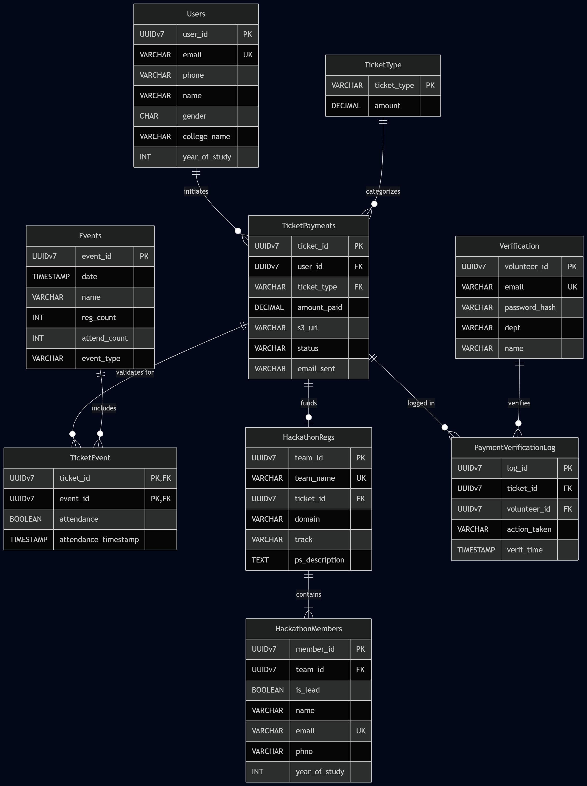

**Users**

| Column | Type | Constraints | Description |
| --- | --- | --- | --- |
| **user_id** | UUIDv7 | **PK** | The user initiating the payment |
| email | VARCHAR(255) | UNIQUE, NOT NULL |  |
| phone | VARCHAR(15) |  |  |
| name | VARCHAR(255) | NOT NULL |  |
| gender | CHAR(1) |  | M/F/O |
| college_name | VARCHAR(255) |  |  |
| year_of_study | INT |  | 1, 2, 3, 4 |
| created_at | TIMESTAMP | DEFAULT NOW() |  |
| updated_at | TIMESTAMP | DEFAULT NOW() |  |

**Events**

| Column       | Type | Constraints | Description |
|--------------| --- | --- | --- |
| **event_id** | UUIDv7 | **PK** |  |
| date         | TIMESTAMP | NOT NULL |  |
| name         | VARCHAR(255) | NOT NULL |  |
| dept_name    | VARCHAR(255) | NOT NULL |  |
| reg_count    | INT | DEFAULT 0 |  |
| attend_count | INT | DEFAULT 0 |  |
| event_type   | VARCHAR(50) | NOT NULL | `TECH`, `NONTECH`, `WORKSHOP`, `HACKATHON`, `RACING` |
| created_at   | TIMESTAMP | DEFAULT NOW() |  |
| updated_at   | TIMESTAMP | DEFAULT NOW() |  |

**TicketType**

| Column | Type | Constraints | Description |
| --- | --- | --- | --- |
| **ticket_type** | VARCHAR(50) | **PK** | `HACKATHON`, `TECHPASS`, `NONTECHPASS`, `RACING`, `WORKSHOP` |
| amount | DECIMAL(10,2) | NULLABLE | Standard pass cost |
| created_at | TIMESTAMP | DEFAULT NOW() |  |
| updated_at | TIMESTAMP | DEFAULT NOW() |  |

**TicketPayments**

| Column | Type | Constraints | Description |
| --- | --- | --- | --- |
| **ticket_id** | UUIDv7 | **PK** |  |
| user_id | UUIDv7 | **FK** -> `Users(user_id)` |  |
| ticket_type | VARCHAR(50) | **FK** -> `TicketType(ticket_type)` |  |
| amount_paid | DECIMAL(10,2) | NOT NULL |  |
| s3_url | VARCHAR(512) | NULLABLE | URL to payment receipt |
| status | VARCHAR(50) | NOT NULL | `PendingPayment`, `NotVerified`, `Accepted`, `Rejected` |
| email_sent | VARCHAR(50) | NULLABLE | `queued`, `sent` |
| created_at | TIMESTAMP | DEFAULT NOW() |  |
| updated_at | TIMESTAMP | DEFAULT NOW() |  |

**TicketEvent**

| Column | Type | Constraints | Description |
| --- | --- | --- | --- |
| **ticket_id** | UUIDv7 | **PK, FK** -> `TicketPayments(ticket_id)` | Composite PK |
| **event_id** | UUIDv7 | **PK, FK** -> `Events(event_id)` | Composite PK |
| attendance | BOOLEAN | DEFAULT FALSE |  |
| attendance_timestamp | TIMESTAMP | NULLABLE | Recorded at door scan |
| created_at | TIMESTAMP | DEFAULT NOW() |  |
| updated_at | TIMESTAMP | DEFAULT NOW() |  |

**HackathonRegs**

| Column | Type | Constraints | Description |
| --- | --- | --- | --- |
| **team_id** | UUIDv7 | **PK** |  |
| team_name | VARCHAR(255) | UNIQUE, NOT NULL |  |
| ticket_id | UUIDv7 | **FK** -> `TicketPayments(ticket_id)` | Link to the 1200 payment |
| domain | VARCHAR(50) | NOT NULL | `Software`, `Hardware` |
| track | VARCHAR(100) | NULLABLE | Specific PS domain (e.g., AgriTech) |
| ps_description | TEXT |  |  |
| created_at | TIMESTAMP | DEFAULT NOW() |  |
| updated_at | TIMESTAMP | DEFAULT NOW() |  |

**HackathonMembers**

| Column | Type | Constraints | Description |
| --- | --- | --- | --- |
| **member_id** | UUIDv7 | **PK** |  |
| team_id | UUIDv7 | **FK** -> `HackathonRegs(team_id)` |  |
| is_lead | BOOLEAN | NOT NULL | Only 1 true per team |
| name | VARCHAR(255) | NOT NULL |  |
| email | VARCHAR(255) | NOT NULL | UNIQUE constraint with `team_id` |
| phno | VARCHAR(15) |  |  |
| year_of_study | INT |  |  |
| created_at | TIMESTAMP | DEFAULT NOW() |  |
| updated_at | TIMESTAMP | DEFAULT NOW() |  |

**Verification**

| Column | Type | Constraints | Description |
| --- | --- | --- | --- |
| **volunteer_id** | UUIDv7 | **PK** |  |
| email | VARCHAR(255) | UNIQUE, NOT NULL |  |
| password_hash | VARCHAR(255) | NOT NULL |  |
| dept | VARCHAR(100) |  |  |
| name | VARCHAR(255) | NOT NULL |  |
| created_at | TIMESTAMP | DEFAULT NOW() |  |
| updated_at | TIMESTAMP | DEFAULT NOW() |  |

**PaymentVerificationLog**

| Column | Type | Constraints | Description |
| --- | --- | --- | --- |
| **log_id** | UUIDv7 | **PK** |  |
| ticket_id | UUIDv7 | **FK** -> `TicketPayments(ticket_id)` |  |
| volunteer_id | UUIDv7 | **FK** -> `Verification(volunteer_id)` |  |
| action_taken | VARCHAR(50) | NOT NULL | `Accepted`, `Rejected` |
| verif_time | TIMESTAMP | DEFAULT NOW() |  |
| created_at | TIMESTAMP | DEFAULT NOW() |  |

