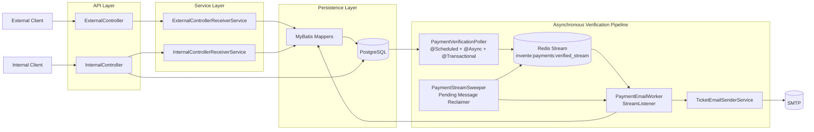
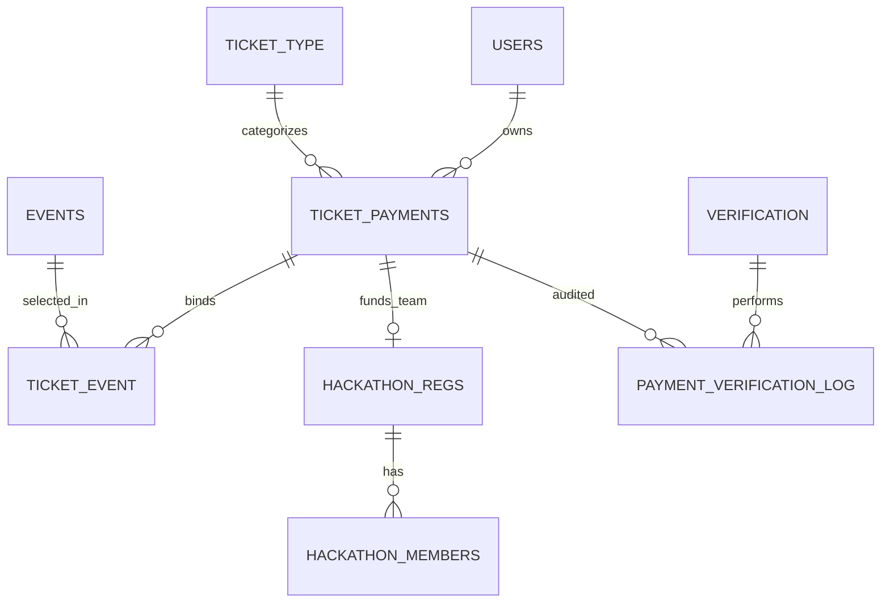
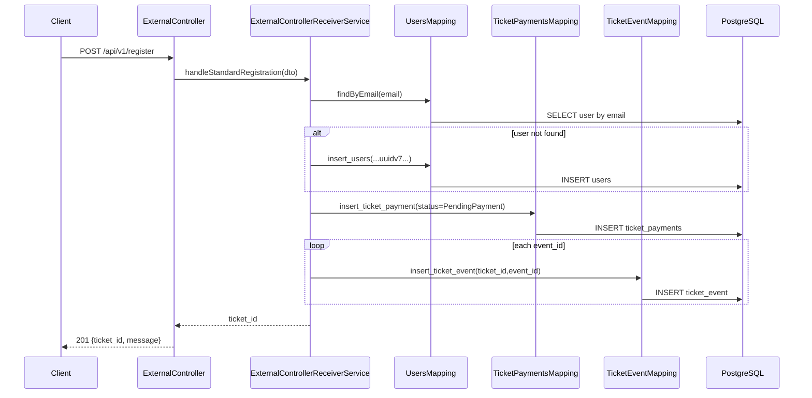
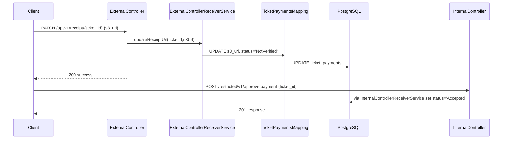
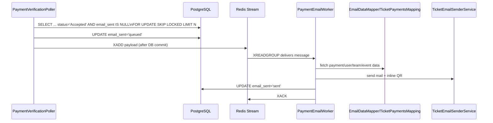
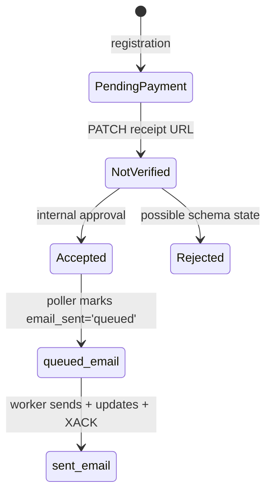

# SSN Invente Payment System Backend 2026

> Spring Boot + MyBatis backend for student registration, payment verification, and asynchronous ticket-email delivery.

## Technical Highlights

- Java 21, Spring Boot 4.2.0-M1, Maven Wrapper
- PostgreSQL schema managed with Flyway SQL migrations
- MyBatis mapper interfaces with inline SQL
- UUIDv7 (time-ordered) IDs for core records
- Redis Streams consumer-group pipeline for async email dispatch
- Concurrency controls with `FOR UPDATE SKIP LOCKED` + transactional publish-after-commit
- SMTP-based ticket emailing with inline QR generation (ZXing)
- Actuator + Prometheus metrics exposure
- k6 load script for registration + approval flow

## Architecture

### High-Level Architecture



### Why these layers exist

- **Controllers** keep HTTP handling minimal (request/response shaping only).
- **Service layer** owns write workflows and transaction boundaries.
- **MyBatis mappers** keep SQL explicit and close to business operations.
- **PostgreSQL** is the authoritative state store.
- **Redis Streams** decouples payment acceptance from slower email IO.
- **Email worker + sweeper** provide at-least-once post-payment processing.

### Project Structure

```text
src/
├── main/
│   ├── java/com/saipbuilds/inventepayment2026/
│   │   ├── Controller/           # Public/internal REST endpoints
│   │   ├── Services/             # Registration, approval, polling, sweeper
│   │   ├── TicketEmailService/   # HTML mail + QR code generation
│   │   ├── mappings/             # MyBatis mapper interfaces + SQL
│   │   ├── entities/             # POJO models mirroring DB tables
│   │   ├── dto/                  # API request contracts
│   │   ├── DBConfig/Redis/       # Redis client + stream listener setup
│   │   ├── Corsconfig/           # CORS policy
│   │   ├── ExceptionHandler/     # Global error shaping
│   │   └── typehandlers/         # UUID JDBC handler for MyBatis
│   └── resources/
│       ├── application.properties
│       ├── db/migration/         # Flyway V1 schema + V2 seed
│       └── invente-orange.png    # QR logo asset
├── test/java/.../Inventepayment2026ApplicationTests.java
Documentation/                    # Existing architecture/schema notes
StressTesting/benchmark.js        # k6 script
pom.xml
mvnw / mvnw.cmd
```

## Domain Model

### Core domain behavior

The backend captures registrations, records proof-of-payment upload, marks payments as accepted through an internal endpoint, then asynchronously sends ticket emails (standard or hackathon team format).

### Core entities and state authority

- **Authoritative payment state:** `ticket_payments.status` (`PendingPayment` → `NotVerified` → `Accepted`/`Rejected`)
- **Async delivery state:** `ticket_payments.email_sent` (`NULL` → `queued` → `sent`)
- **User identity reuse:** `users` by unique `email`
- **Hackathon composition:** `hackathon_regs` (team) + `hackathon_members`

### Entity relationship diagram



## Request Lifecycle (Important Flows)

### 1) Standard registration



### 2) Receipt upload + manual acceptance



### 3) Accepted-payment async email pipeline



## API Reference

| Method | Endpoint | Purpose | Auth visible in repo |
|---|---|---|---|
| POST | `/api/v1/register` | Standard registration and ticket creation | None enforced in code |
| POST | `/api/v1/register-hackathon` | Hackathon team registration | None enforced in code |
| PATCH | `/api/v1/receipt/{ticket_id}` | Attach receipt URL and move to `NotVerified` | None enforced in code |
| GET | `/api/v1/events` | Event catalog for selection | None enforced in code |
| GET | `/api/v1/hackathon-stats` | Hackathon aggregate counts by domain | None enforced in code |
| POST | `/restricted/v1/approve-payment` | Internal payment acceptance | Route naming implies internal; no Spring Security guard present |

### Request contracts

- `StandardRegistrationRequest`
  - `email, phone, name, gender, college_name, year_of_study, ticket_type, amount_to_be_paid, event_ids[]`
- `HackathonRegistrationRequest`
  - `leader{email, phone, name, gender, college_name, year_of_study}, team_name, domain, track, ps_description, members[], amount_to_be_paid`
- Receipt patch body: `{ "s3_url": "..." }`
- Internal approval body: `{ "ticket_id": "<uuid>" }`

### Validation behavior

- No Bean Validation annotations (`@NotNull`, `@Valid`, etc.) are used in DTOs/controllers.
- Explicit checks only:
  - receipt upload ensures non-empty `s3_url`
  - internal approval ensures `ticket_id` field exists and parses as UUID
- Remaining integrity relies on DB constraints and runtime exceptions.

## Database Architecture

### Technology and migration strategy

- PostgreSQL + Flyway SQL migrations (`V1__Initial_schema.sql`, `V2__Event_Data__Ticket_Type_Seed.sql`)
- V1 creates schema/tables/indexes/triggers.
- V2 seeds ticket types and large event catalog.

### Key constraints and indexes

- PKs on all core tables.
- Unique: `users.email`, `verification.email`, `hackathon_members(team_id,email)`.
- Partial unique index: one lead per hackathon team:
  - `CREATE UNIQUE INDEX uk_hackathon_team_lead ... WHERE is_lead = TRUE`
- FK cascade deletes on many dependent rows (`ticket_event`, `hackathon_regs`, `hackathon_members`, verification logs).
- Query-oriented indexes:
  - `ticket_payments(status)`, `ticket_payments(email_sent)` for poller/worker
  - FK helper indexes for join paths

### UUID strategy

Application code creates UUIDv7-like time-ordered IDs via:

```java
private UUID createUUIDV7() {
    return UuidCreator.getTimeOrderedEpoch();
}
```

Used for `ticket_id`, `user_id`, `team_id` creation in service methods.

### Transaction boundaries

`@Transactional` wraps:

- `handleStandardRegistration`
- `handleHackathonRegistration`
- `updateReceiptUrl`
- `setPaymentVerified`
- `pollAndPublishVerifiedPayments`

This provides atomicity for multi-table writes and for the poller’s queue-marking phase.

## Caching & Redis

### Redis role in this repository

Redis is used for:

1. **Message broker** (`Redis Streams`) for post-acceptance email jobs
2. **Daily email quota counter** (`emails_sent:YYYY-MM-DD`)

Redis is **not** the source of truth for payments; PostgreSQL is.

### Stream topology

- Stream key: `invente:payments:verified_stream`
- Consumer group: `email-workers-group`
- Consumer name configured: `worker-node-1`
- Listener: `StreamMessageListenerContainer` with 1s poll timeout
- Worker thread pool: 5 threads (`EmailWorker-`)

### Invalidation / divergence behavior

- Poller updates DB `email_sent='queued'` first, then publishes to Redis in `afterCommit()`.
- If publish fails before commit, DB transaction rolls back.
- If worker fails after read and before `XACK`, message remains pending (PEL) and may be reclaimed by sweeper.

## Concurrency & Consistency

### Primary anti-race mechanisms

1. **DB row-level locking for polling**

```sql
SELECT ticket_id, user_id, ticket_type
FROM ...ticket_payments
WHERE status = 'Accepted' AND email_sent IS NULL
LIMIT #{batchSize}
FOR UPDATE SKIP LOCKED
```

Prevents competing poller executions from selecting the same rows.

2. **Commit-then-publish sequencing**

```java
TransactionSynchronizationManager.registerSynchronization(
  new TransactionSynchronization() {
    @Override
    public void afterCommit() {
      redisTemplate.opsForStream().add(STREAM_KEY, payload);
    }
  }
);
```

Prevents stream consumers from seeing work before DB reflects `queued` state.

3. **At-least-once recovery**

Sweeper checks PEL and reclaims stuck messages with `XCLAIM`, then re-runs worker logic.

### Notable implementation caveat

`PaymentStreamSweeper` comment says "every 5 minutes", but code uses `@Scheduled(fixedDelay = 60)` (60 ms default unit), so actual schedule is much more frequent unless overridden.

## Payment / External Integrations

### Integration points implemented

- **Receipt URL ingestion:** stores provided `s3_url` string in DB; upload itself is external to this backend.
- **Email delivery:** JavaMailSender via SMTP (`spring.mail.*`).
- **QR generation:** ZXing QR encoder, embeds `invente-orange.png`, attaches inline image.

### Payment state machine visible from code



`Rejected` path is modeled in schema (`CHECK`) but no explicit rejection endpoint exists in current controllers.

## Security

### Current security posture from repository evidence

- No Spring Security configuration classes or filter chains are present.
- No JWT/session/auth middleware is implemented despite `jjwt` dependencies in `pom.xml`.
- The `/restricted/v1/approve-payment` route is not guarded in application code.
- CORS configuration is permissive:
  - `allowedOriginPatterns("*")`
  - credentials enabled
  - broad methods/headers

### Input and error safety

- JSON naming strategy is snake_case.
- Generic global exception handler returns opaque 500 with generated `error_id`.
- Custom `/error` handler returns generic unknown-error payload.

## Error Handling

### Global model

- `@RestControllerAdvice` catches all `Exception` and returns:

```json
{
  "message": "Something went wrong. Please try again later.",
  "error_id": "<uuid>"
}
```

- `CustomErrorController` handles `/error` with fallback payload including servlet error status/message.
- Controllers also emit explicit 400 for missing required ad-hoc fields (`s3_url`, `ticket_id`).

## Performance Engineering

Problem → Technique → Expected benefit:

- **Competing async workers** → `FOR UPDATE SKIP LOCKED` batch polling → reduce duplicate picks and blocking.
- **High write/read pressure around email dispatch** → Redis stream decoupling → keep HTTP/DB mutation paths short.
- **High Redis concurrency** → Lettuce pooled config (`maxTotal=64`, `maxIdle=32`, `minIdle=16`) → lower connection churn.
- **Frequent status scans** → indexes on `ticket_payments(status, email_sent)` → faster poller candidate queries.
- **Non-deterministic UUID insertion locality** → time-ordered UUID generation for major IDs → improved index locality versus random UUIDv4.

## Load / Stress Testing

Repository includes **k6** script: `StressTesting/benchmark.js`

- Scenario:
  - ramp to 700 VUs in 10s
  - hold 1000 VUs for 30s
  - ramp down in 10s
- Flow tested per iteration:
  1. `POST /api/v1/register`
  2. `POST /restricted/v1/approve-payment`
- Script generates unique email/phone values to avoid unique-key collisions.

Run:

```bash
k6 run StressTesting/benchmark.js
```

## Configuration

### Required runtime configuration (visible)

- `POSTGRES_URL`
- `POSTGRES_USER`
- PostgreSQL password property is configured but masked in repository view output
- `MAIL_ID`
- mail password property is configured but masked in repository view output
- `REDIS_HOST`
- `REDIS_PORT`
- Redis password property is configured and read by `RedisConfig`
- `EMAIL_KILLSWITCH` (must be `on` to send emails)

### Application defaults

- Port: `8080`
- Hikari max pool: `25`
- Redis client: Lettuce
- Actuator exposure: `health,info,prometheus`
- Health details: `never`

## Local Development

### Prerequisites

- JDK 21
- Docker or local PostgreSQL + Redis
- Maven (or use included wrapper)
- Optional: k6 for stress testing

### Run steps

```bash
git clone <repo-url>
cd SSNInventePaymentSystem_Backend2026

# set required env vars
export POSTGRES_URL='jdbc:postgresql://localhost:5432/invente_payment_db'
export POSTGRES_USER='<db-user>'
# export SPRING_DATASOURCE_PASSWORD='<db-password>' or property equivalent
export REDIS_HOST='localhost'
export REDIS_PORT='6379'
# export SPRING_DATA_REDIS_PASSWORD='<redis-password>' if required
export MAIL_ID='<smtp-user>'
# export SPRING_MAIL_PASSWORD='<smtp-pass>'
export EMAIL_KILLSWITCH='off'

./mvnw spring-boot:run
```

Windows (PowerShell) equivalents:

```powershell
$env:POSTGRES_URL='jdbc:postgresql://localhost:5432/invente_payment_db'
$env:POSTGRES_USER='<db-user>'
$env:REDIS_HOST='localhost'
$env:REDIS_PORT='6379'
$env:MAIL_ID='<smtp-user>'
$env:EMAIL_KILLSWITCH='off'
.\mvnw.cmd spring-boot:run
```


## Engineering Decisions and Trade-offs

1. **PostgreSQL-first truth + Redis as async transport**
   - Keeps durable payment state in DB while allowing non-blocking downstream processing.
2. **Explicit SQL via MyBatis**
   - Chosen over ORM entity graphs; provides direct control of joins/locks/updates important for payment flow.
3. **Time-ordered UUID generation**
   - Supports globally unique IDs with better insertion locality than random UUIDs.
4. **At-least-once delivery instead of exactly-once**
   - Simpler recovery with PEL reclaim; may produce duplicate email sends in some failure races.

## Why This Architecture?

The design separates **transactional state mutation** from **slow side effects**:

- Registration and approval writes are short DB transactions.
- Email generation/sending is shifted to Redis stream workers.
- `SKIP LOCKED` and commit-ordered publish provide practical cross-thread consistency.
- DB constraints (FK/unique/check/partial unique) provide final integrity boundaries independent of app node count.

## Operational Failure Modes

- **Database unavailable:** request handlers and poller fail; global handler returns 500.
- **Redis unavailable:** poller cannot publish; publish inside transactional flow can trigger rollback, leaving rows eligible for future polling.
- **SMTP failure:** worker catches exception; message is not XACKed and remains in PEL for sweeper reclaim.
- **Duplicate request data:** unique constraints (e.g., `users.email`) enforce hard-stop integrity.
- **Malformed payload:** some explicit 400 checks exist; otherwise parse/runtime exceptions become 500.
- **Invalid internal approval ticket ID:** UUID parse or missing ticket triggers client error / false path.
- **Cache miss / stale cache:** not a major path since Redis is not authoritative for domain state.

## Future Improvements

- Add explicit authz/authn on `/restricted/*` routes.
- Add Bean Validation annotations + consistent 4xx error schema.
- Align sweeper schedule value with intended cadence.
- Add idempotency safeguards in worker send path (e.g., lock `email_sent='processing'` before send).
- Add integration tests for concurrency and failure-recovery paths.
