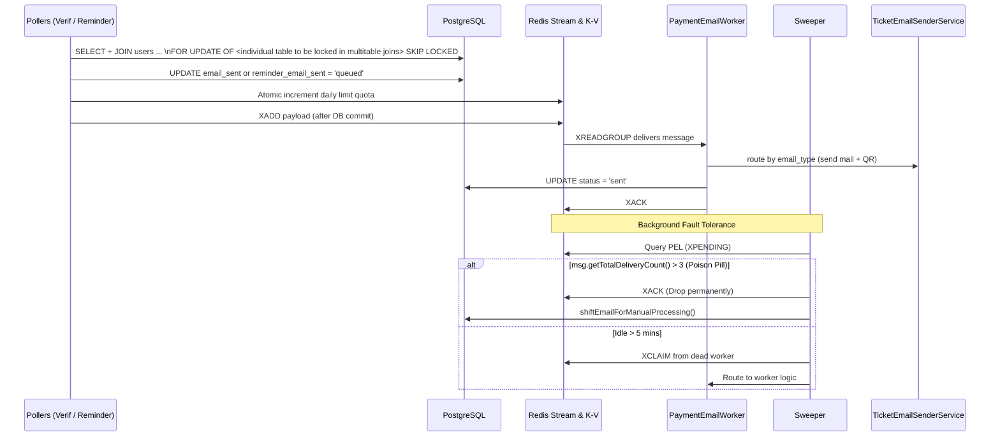

# SSN Invente Payment System Backend 2026

> Spring Boot + MyBatis backend for student registration, payment verification, and asynchronous ticket-email delivery, fronted by an Nginx API Gateway.

## Technical Highlights

* Java 21, Spring Boot 4.2.0-M1, Maven Wrapper
* PostgreSQL schema managed with Flyway SQL migrations
* MyBatis mapper interfaces with inline SQL (with efforts taken to avoid N+1 db access)
* UUIDv7 (time-ordered) IDs for core records
* Redis Streams consumer-group pipeline for async email dispatch
* True Thread Isolation: Distinct thread pools for different asynchronous polling tasks
* Concurrency controls with `FOR UPDATE SKIP LOCKED` + transactional publish-after-commit
* SMTP-based ticket emailing with inline QR generation (ZXing)
* Nginx Reverse Proxy on server for SSL termination, dynamic CORS, rate-limiting, and reverse proxying.
* Full Observability Stack: Actuator + Prometheus + Grafana + DB/Redis Exporters

## Architecture & Data Flow

The lifecycle of a payment processing event flows through four distinct components:

### 1. The Pollers (`PaymentVerificationPoller` & `ReminderEmailPoller`)

* **Trigger:** `PaymentVerificationPoller` executes every 30 seconds (`30000` ms) and `ReminderEmailPoller` executes every 10 seconds (`10000` ms), dynamically configured via environment variables. Each utilizes its own isolated 5-thread pool (`verificationPollerExecutor` and `reminderPollerExecutor`) to prevent queue contention.
* **Batching:** Fetch up to 20 eligible payments from PostgreSQL per run, respecting a shared hard daily limit of 1000 emails tracked via atomic Redis keys.
* **Grace Period:** The `ReminderEmailPoller` strictly targets pending tickets lacking an uploaded receipt (`s3_url IS NULL`) and enforces a 3-minute delay (`created_at <= NOW() - INTERVAL '3 minutes'`) to give users time to complete transactions before triggering alerts.
* **Payload Routing:** Inject an `email_type` flag (`tech`, `hack`, or `payment_reminder`) into the payload to dictate downstream worker behavior.
* **State Update:** Mark the fetched database rows as `queued` (updating either the `email_sent` or `reminder_email_sent` columns) via `FOR UPDATE OF tps SKIP LOCKED` queries utilizing partial indexes.
* **Transaction Synchronization:** To prevent a race condition where workers pull messages before the database commit finishes, the Pollers use `TransactionSynchronizationManager.afterCommit()`. They only execute the Redis `XADD` command to publish the payload after PostgreSQL confirms the `queued` state is permanently saved.

### 2. The Message Broker (Redis Streams)

* **Stream Key:** `invente:payments:verified_stream`. (A unified stream is used for all email types to minimize connections and infrastructure overhead).
* **Consumer Group:** `email-workers-group`.
* **Mechanism:** Distributes messages to workers using the `XREADGROUP` command. This ensures mutual exclusion (no two workers receive the same message simultaneously) and tracks in-flight tasks in a Pending Entries List (PEL).

### 3. The Consumer (`PaymentEmailWorker`)

* **Listening Loop:** A `StreamMessageListenerContainer` continuously polls the Redis Stream using a 1-second block timeout. To prevent `RedisCommandTimeoutException` crashes, the underlying Lettuce client is configured with a broader 10-second command timeout.
* **Concurrency:** When messages arrive, they are dispatched to a dedicated 5-thread execution pool (`EmailWorker-1` to `EmailWorker-5`).
* **Dynamic Routing & Execution:** Extracts the `email_type` field to route the request dynamically (Tech Pass, Hackathon Pass, or Payment Proof Reminder). Executes the heavy SMTP/PDF generation network tasks, updates the specific PostgreSQL status column to `sent`, and only then issues an `XACK` command to Redis.
* **Completion:** The `XACK` command removes the message from the PEL, marking it permanently resolved.

### 4. Fault Tolerance (`PaymentStreamSweeper`)

* **Failure State:** If an `EmailWorker` thread crashes or hangs mid-process, the database remains marked as `queued` and the message sits unacknowledged in the Redis PEL indefinitely.
* **Recovery:** A background `@Scheduled` sweeper runs every 5 minutes. It queries the PEL (`XPENDING`) for any messages that have been stuck for 1 minute or longer.
* **Re-routing:** Using the `XCLAIM` command, the sweeper forcefully strips ownership of the message from the dead worker thread and pipes the payload directly back into the `PaymentEmailWorker.onMessage()` method for reprocessing.
* **Poison Pill:** If a message fails to process after 3 attempts (EmailWorker grabs, fails, puts into PEL, picked up by PSSweeper and given back to EmailWorker for a maximum of 3 retries), it is dropped from the PEL and logged in the table as "Processing" for manual investigation. This prevents infinite retry loops (the polling service will now ignore this) on unprocessable messages.

## Thread Pool Isolation

To prevent thread exhaustion cascading across the application, the system strictly isolates blocking operations into three separated domains:

* **Poller Pools:** 5 threads dedicated to querying verified payments (`verificationPollerExecutor`) and 5 threads dedicated to querying pending reminders (`reminderPollerExecutor`). Backed by queue capacities of 50 to absorb database slowdowns without crossing over.
* **Worker Pool:** 5 threads (`EmailWorker-`) dedicated exclusively to executing the slow SMTP/PDF generation tasks.
* **Database Pool (Hikari):** Worker methods are intentionally **not** `@Transactional` (except for the final micro-update). This ensures long-running email network calls do not hold database connections hostage, preserving the Hikari pool for external web traffic.

## Known Architectural Tradeoffs

**At-Least-Once Delivery:** This pipeline prioritizes architectural simplicity over strict exactly-once processing. It does not employ atomic locking on the worker side.

* **The Zombie Worker Scenario:** If an original worker thread stalls for >1 minute, the Sweeper will claim and reprocess the message. If the original worker later wakes up and finishes its execution, a duplicate email will be sent. This minor redundancy is accepted as a standard tradeoff to avoid the complexity and overhead of distributed database locks.

* System Design @ Saipranav, readme generated using LLM.
## Architecture

### High-Level Architecture

```mermaid
flowchart LR

    Client["External Client (not a part of this Repo)"]
    InternalClient["Internal Client (Admin)"]

    subgraph Edge["Edge / Gateway"]
        Nginx["Nginx Reverse Proxy<br/>(SSL, CORS, Rate Limit)"]
    end

    subgraph API["API Layer"]
        ExternalController["ExternalController<br/>(Port 8080)<br/>Payment System Backend - This repo"]
        AdminAPI["Admin Backend - Not this Repo <br/>(Port 4000)"]
    end

    subgraph Services["Service Layer"]
        ExternalService["ExternalControllerReceiverService"]
    end

    subgraph Persistence["Persistence Layer"]
        MyBatisMappers["MyBatis Mappers"]
        PostgreSQL[("PostgreSQL")]
    end

    Client -->|HTTPS /api/| Nginx
    InternalClient -->|HTTPS /fileapi/| Nginx

    Nginx -->|Proxy Pass| ExternalController
    Nginx -->|Proxy Pass - Strip fileapi prefix| AdminAPI

    ExternalController --> ExternalService
    ExternalService --> MyBatisMappers
    AdminAPI --> PostgreSQL
    MyBatisMappers --> PostgreSQL

    subgraph Async["Asynchronous Email Pipeline"]
        VerifPoller["PaymentVerificationPoller<br/>@Async verificationPollerExecutor"]
        ReminderPoller["ReminderEmailPoller<br/>@Async reminderPollerExecutor"]
        RedisStream[("Redis Stream<br/>invente:payments:verified_stream")]
        Worker["PaymentEmailWorker<br/>StreamListener"]
        Sweeper["PaymentStreamSweeper<br/>(Poison Pill Protection)"]
        EmailService["TicketEmailSenderService"]
    end

    PostgreSQL --> VerifPoller
    PostgreSQL --> ReminderPoller

    VerifPoller --> RedisStream
    ReminderPoller --> RedisStream

    RedisStream --> Worker
    Sweeper --> RedisStream
    Sweeper --> Worker

    Worker --> MyBatisMappers
    Worker --> EmailService

    EmailService --> SMTP[("SMTP")]

```

### Why these layers exist

* **Nginx API Gateway** centralizes SSL, drops malicious traffic, enforces CORS dynamically, and routes to multiple internal microservices (Java Backend, Admin Backend, Grafana, RedisInsight) while keeping internal ports closed to the host.
* **Service layer** owns write workflows and transaction boundaries.
* **MyBatis mappers** keep SQL explicit and close to business operations.
* **PostgreSQL** is the authoritative state store.
* **Redis Streams** decouples payment acceptance & ticket sending and reminder scheduling from slower email IO.
* **Email worker + sweeper** provide at-least-once post-payment processing and self-healing against poison pills.

## Domain Model

### Core domain behavior

The backend captures registrations, records proof-of-payment upload, receives payment Approval / Rejected information from the Authoritative State Store (modified by authenticated volunteers using the Admin-Backend) , then asynchronously sends ticket emails (standard or hackathon team format). It also evaluates pending payments (proof upload not done for >3 mins) to dispatch automated reminder emails.

### Core entities and state authority

* **Authoritative payment state:** `ticket_payments.status` (`PendingPayment` → `NotVerified` → `Accepted`/`Rejected`)
* **Verification async delivery state:** `ticket_payments.email_sent` (`NULL` → `queued` → `sent`)
* **Reminder async delivery state:** `ticket_payments.reminder_email_sent` / `reminder_email_2_sent` (`NULL` → `queued` → `sent`)
* **User identity reuse:** `users` by unique `email`

## Request Lifecycle (Important Flows)

### 1) Accepted-payment & Reminder Async Email Pipeline

## Database Architecture

### Technology and migration strategy

* PostgreSQL + Flyway SQL migrations (`V1__Initial_schema.sql`, `V2__Event_Data__Ticket_Type_Seed.sql`).
* Schema tracks highly granular delivery states (`email_sent`, `reminder_email_sent`, `reminder_email_2_sent`).

### Key constraints and indexes

* PKs on all core tables.
* Query-oriented **Partial Indexes** for ultra-fast queue polling without full table scans:
* `CREATE INDEX idx_tps_email_sent_null ON ticket_payments (ticket_id) WHERE status = 'Accepted' AND email_sent IS NULL;`
* `CREATE INDEX idx_tps_reminder_email_null ON ticket_payments (ticket_id) WHERE reminder_email_sent IS NULL AND s3_url IS NULL;`

* Row-level locking uses `FOR UPDATE OF tps SKIP LOCKED` to exclusively lock the `ticket_payments` table without locking joined reference tables (like `users`).

## Caching & Redis

### Redis role in this repository

Redis is used for:

1. **Message broker** (`Redis Streams`) for post-acceptance and reminder email jobs.
2. **Daily email quota counter** (`emails_sent:YYYY-MM-DD`). Uses an atomic Redis `INCR` counter with a date-scoped key. The key's 24-hour TTL is set only on the first increment of the day, avoiding redundant `EXPIRE` calls for subsequent emails while automatically resetting the counter each day.

### Stream topology & Fault Tolerance

* Stream key: `invente:payments:verified_stream` (Unified queue for all `email_type` payloads). Payload is intentionally lean yet contains the type of email, and required join keys to gather information from the database once consumed by worker.
* Consumer group: `email-workers-group`.
* **Poison Pill Protection:** The `PaymentStreamSweeper` monitors the Pending Entries List (PEL). If a message's `getTotalDeliveryCount()` exceeds 5 (e.g., malformed SMTP address), it forces an `XACK` to drop it from Redis and flags the ticket in Postgres for manual review to prevent infinite processing loops.

## Concurrency & Consistency

### Primary anti-race mechanisms

1. **Strict Thread Pool Isolation**
To prevent database latency spikes in one polling task from exhausting resources for another, the system uses distinct, dedicated physical thread pools injected via qualifier:
* `verificationPollerExecutor` (5 core threads, 50 queue capacity)
* `reminderPollerExecutor` (5 core threads, 50 queue capacity)
* `EmailWorker-` (5 threads reserved strictly for slow SMTP network calls)

2. **Commit-then-publish sequencing**
`TransactionSynchronizationManager.afterCommit()` guarantees that the Redis stream only receives the message `XADD` *after* PostgreSQL has successfully committed the `queued` state and the Poller picks it up, and `XACK` is sent only once the database records completion. Transactional Outbox Producer pattern maintained strictly. 

## Security & Edge Configuration

### Nginx API Gateway Posture

* **Port Isolation:** Internal backend services (Ports 8080, 4000) are inaccessible from the host. All external traffic is forced through Nginx on Port 443.
* **Path Stripping:** Requests hitting `https://.../fileapi/` are seamlessly proxied to the Admin Backend root (`/`) using trailing-slash stripping.
* **Rate Limiting:** `limit_req_zone` restricts traffic to n requests/second per IP with burst queues to mitigate brute-force/DDoS attempts.
* **Protected Telemetry:** Endpoints for Grafana (`/monitoring/`) and RedisInsight (`/redis/`) are protected via basic authentication (`htpasswd`).

@Saipranav, 01 Sept 2026
