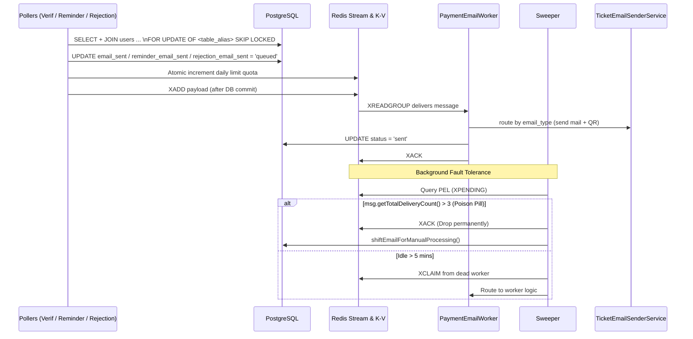

# SSN Invente 2026: Payment & Registration System Architecture - Documentation with Gemini, Designed by Saipranav

The Invente Payment System is a high-concurrency Spring Boot application built to handle unpredictable registration spikes without dropping transactions or deadlocking the database. The architecture strictly separates HTTP ingress from downstream processing, using an Nginx API Gateway at the edge, PostgreSQL as the absolute source of truth, and Redis Streams as the asynchronous message broker.

*Transactional Outbox Pattern Strictly Followed*

## Technical Highlights

* **Java 21, Spring Boot 4.2.0-M1**, Maven Wrapper (Multi-platform Docker: AMD64/ARM64)
* **PostgreSQL** schema managed with Flyway SQL migrations
* **MyBatis** mapper interfaces with inline SQL (optimized to avoid N+1 db access)
* **UUIDv7** (time-ordered) IDs for core records
* **Redis Streams** consumer-group pipeline for async email dispatch
* **True Thread Isolation:** Distinct thread pools for different asynchronous polling tasks
* **Concurrency controls** with `FOR UPDATE OF <table> SKIP LOCKED` + strict transactional publish_redis-after-commit_db to maintain source of truth
* **SMTP-based** ticket emailing with inline QR generation (ZXing)
* **Nginx Reverse Proxy** on the server for SSL termination, dynamic CORS, rate-limiting, and path stripping
* **Full Observability Stack:** Actuator + Prometheus + Grafana + DB/Redis Exporters

---

## 1. High-Level Architecture & Data Flow

```mermaid
flowchart LR

    Client["External Client (This Repo)"]
    InternalClient["Internal Client not a part of this repo(Admin)"]

    subgraph Edge["Edge / Gateway"]
        Nginx["Nginx Reverse Proxy<br/>(SSL, CORS, Rate Limit)"]
    end

    subgraph API["API Layer"]
        ExternalController["ExternalController<br/>(Port 8080)<br/>Payment System Backend - This repo"]
        AdminAPI["Admin Backend - Not this Repo <br/>(Port 4000)"]
    end

    subgraph Services["Service Layer"]
        ExternalService["ExternalControllerReceiverService"]
    end

    subgraph Persistence["Persistence Layer"]
        MyBatisMappers["MyBatis Mappers"]
        PostgreSQL[("PostgreSQL")]
    end

    Client -->|HTTPS /api/| Nginx
    InternalClient -->|HTTPS /fileapi/| Nginx

    Nginx -->|Proxy Pass| ExternalController
    Nginx -->|Proxy Pass - Strip fileapi prefix| AdminAPI

    ExternalController --> ExternalService
    ExternalService --> MyBatisMappers
    AdminAPI --> PostgreSQL
    MyBatisMappers --> PostgreSQL

    subgraph Async["Asynchronous Email Pipeline"]
        VerifPoller["PaymentVerificationPoller<br/>@Async verificationPollerExecutor"]
        ReminderPoller["ReminderEmailPoller<br/>@Async reminderPollerExecutor"]
        RejectionPoller["RejectionEmailPoller<br/>@Async rejectionPollerExecutor"]
        RedisStream[("Redis Stream<br/>invente:payments:verified_stream")]
        Worker["PaymentEmailWorker<br/>StreamListener"]
        Sweeper["PaymentStreamSweeper<br/>(Poison Pill Protection)"]
        EmailService["TicketEmailSenderService"]
    end

    PostgreSQL --> VerifPoller
    PostgreSQL --> ReminderPoller
    PostgreSQL --> RejectionPoller

    VerifPoller --> RedisStream
    ReminderPoller --> RedisStream
    RejectionPoller --> RedisStream

    RedisStream --> Worker
    Sweeper --> RedisStream
    Sweeper --> Worker

    Worker --> MyBatisMappers
    Worker --> EmailService

    EmailService --> SMTP[("SMTP")]

```



### Request Lifecycle (Accepted-Payment, Reminder, & Rejection Pipeline)



---

## 2. Data Modeling & Separation of Concerns

The application enforces a strict boundary between edge ingress, internal business logic, and persistent state.

* **The Edge (Nginx):** Handles all cross-origin security, drops malicious requests, and seamlessly proxies traffic to isolated internal Docker networks (e.g., stripping `/fileapi/` down to the Admin Backend).
* **Controllers & DTOs:** The API layer speaks exclusively in Data Transfer Objects (DTOs). Jackson is globally configured to translate incoming `snake_case` JSON into Java `camelCase`. Controllers handle zero business logic.
* **The Service Layer:** Acts as the traffic cop. It accepts DTOs, enforces business constraints (e.g., the 50-team hackathon cap), maps the data into rigid Database Entities, and manages `@Transactional` boundaries.
* **Entities & MyBatis:** Entities are mathematically pure, 1:1 representations of Postgres tables. MyBatis handles the I/O. For complex reads, MyBatis completely eliminates the N+1 problem by hydrating specialized Projection DTOs directly from SQL `JOIN` queries.
* **Database Triggers:** To ensure data integrity, `updated_at` columns are not managed by Java. PostgreSQL `BEFORE UPDATE` triggers handle timestamping autonomously, guaranteeing precision for our polling workers regardless of how the row was mutated.

---

## 3. The Asynchronous Processing Engine

The core technical challenge is safely moving verified payments out of the database and into downstream processes (email, QR generation, roster updates) without blocking API threads or processing the same payment twice. We solve this using a transactional polling pattern feeding into Redis Streams.

### Phase 1: Ingestion & State Lock

1. **User Registration:** A student registers and uploads a receipt. The system opens a `@Transactional` block, inserts the `Users` and `TicketPayments` records, sets the status to `NotVerified`, and commits.
2. **Volunteer Action:** A volunteer reviews the receipt and approves or rejects it via the Admin Backend. The Service layer updates the payment status to `Accepted` or `Rejected` and writes an audit row to `PaymentVerificationLog` atomically.

### Phase 2: The Scheduled Batch Pollers

To prevent database thrashing, we do not trigger downstream events on a per-request basis. Instead, three distinct scheduled workers sweep the database on isolated thread pools, fetching up to 20 eligible payments per run:

* **`PaymentVerificationPoller`:** Sweeps for accepted payments every 30 seconds.
* **`ReminderEmailPoller`:** Sweeps every 10 seconds. Strictly targets pending tickets lacking an uploaded receipt (`s3_url IS NULL`) and enforces a 3-minute grace period (`created_at <= NOW() - INTERVAL '3 minutes'`) to give users time to complete transactions.
* **`RejectionEmailPoller`:** Operates identically to the Reminder poller, sweeping for payments marked as `Rejected` where notification has not yet been dispatched.

**Partial Indexing & Locking:**

```sql
SELECT tps.ticket_id, tps.user_id, u.email 
FROM invente_payment_db.public.ticket_payments tps 
JOIN invente_payment_db.public.users u ON tps.user_id = u.user_id 
WHERE tps.status = 'Accepted' AND tps.email_sent IS NULL 
LIMIT 20 
FOR UPDATE OF tps SKIP LOCKED;

```

*`OF tps SKIP LOCKED`-* If two poller nodes run simultaneously, Node B will instantly skip the rows Node A is currently locking. The `OF tps` directive ensures PostgreSQL only locks the payment records, leaving the joined `users` table entirely unlocked for concurrent registrations.

### Phase 3: The Handoff (Commit-Then-Publish)

The DB Poller cannot block while talking to Redis, nor can it risk publishing a message before the database commit completes.

1. The poller grabs the locked batch, injects an `email_type` flag (`tech`, `hack`, `payment_reminder`, `payment_rejected`), evaluates daily quotas via an atomic Redis increment, and executes `UPDATE ticket_payments SET ... = 'queued' WHERE ticket_id IN (...)`.
2. Instead of publishing immediately, the worker registers a `TransactionSynchronizationManager.afterCommit()` callback.
3. Once PostgreSQL physically commits the `queued` state and drops the row locks, the callback fires and executes `XADD`, pushing the payment payloads into a unified Redis Stream (`invente:payments:verified_stream`).

### Phase 4: Redis Stream Consumers & Fault Tolerance

Redis acts as an at-least-once delivery buffer, distributing messages via the `email-workers-group` consumer group.

1. **Execution:** A dedicated `EmailWorker` thread pulls a message, routes it dynamically by `email_type`, executes heavy SMTP/PDF generation network tasks, and updates the database to `sent`.
2. **Acknowledgment:** The worker issues an `XACK` to remove the message from the Pending Entries List (PEL).
3. **The Sweeper (Self-Healing):** If a worker crashes mid-process, the message remains in the PEL indefinitely. A background sweeper running every 5 minutes identifies messages idle for >1 minute and uses `XCLAIM` to strip ownership from the dead thread, piping the payload back into the worker pool for reprocessing.
4. **Poison Pill Protection:** If a message fails after 3 attempts (e.g., a structurally invalid RFC 5321 email address), the Sweeper forces an `XACK` to permanently drop it from Redis and updates the database to a "Processing" state for manual review. This prevents infinite retry loops.

### Resilience & Rollback Architecture

* **The Exception:** If Redis goes down during the transaction (e.g., while executing the atomic daily quota check), the Lettuce client throws a `RedisConnectionFailureException`.
* **The Automatic Rollback:** Spring's transaction manager intercepts this uncaught runtime exception and instantly sends a `ROLLBACK` command to PostgreSQL since the service method for polling is `@Transactional`.
* **The Lock Release:** PostgreSQL natively drops all row locks associated with the aborted transaction. The records remain safely in the database in their original un-queued state, ready to be picked up by the next scheduled polling cycle once Redis recovers. `commandTimeout` is strictly capped at 10 seconds to prevent hanging connections from exhausting the database pool (Redis doesn't respond but the TCP remains open).

---

## 4. Resource Management & Isolation

To prevent thread exhaustion cascading across the application, the system strictly isolates blocking operations into distinct domains:

### Thread Pool Isolation

* **Poller Pools:** 5 threads dedicated to querying verified payments (`verificationPollerExecutor`), 5 for pending reminders (`reminderPollerExecutor`), and 2 for rejected notifications (`rejectionPollerExecutor`). Backed by queue capacities of 50 to absorb database slowdowns without crossing over.
* **Worker Pool:** 5 threads (`EmailWorker-1` to `EmailWorker-5`) dedicated exclusively to executing slow SMTP network calls.
* **Database Pool (Hikari):** Worker methods are intentionally **not** `@Transactional` (except for final micro-updates). This ensures long-running email network calls do not hold database connections hostage, preserving the Hikari pool for external web traffic.

### Redis Connection Pooling

The Redis integration utilizes the `LettuceConnectionFactory` combined with `GenericObjectPoolConfig` to maintain a highly concurrent connection pool:

* `maxTotal`: 64 (Aligns with Tomcat thread limits to prevent bottlenecking)
* `maxIdle`: 32 (Buffer for scale-down)
* `minIdle`: 16 (Prevents cold-start latency spikes)

---

## 5. Security & Edge Configuration

* **Port Isolation:** Internal backend services (Ports 8080, 4000) are inaccessible from the host. All external traffic is forced through Nginx on Port 443.
* **Path Stripping:** Requests hitting `https://.../fileapi/ or /api/` are seamlessly proxied to the Admin Backend root (`/`) using trailing-slash stripping or Spring root(`/api`) .
* **Rate Limiting:** `limit_req_zone` restricts traffic to 10 requests/second per IP with burst queues to mitigate brute-force/DDoS attempts.
* **Protected Telemetry:** Endpoints for Grafana (`/monitoring/`) and RedisInsight (`/redis/`) are protected via authentication (`htpasswd`).

---

## 6. Known Architectural Tradeoffs

**At-Least-Once Delivery:** This pipeline prioritizes architectural simplicity over strict exactly-once processing. It does not employ atomic locking on the worker side.

* **The Zombie Worker Scenario:** If an original worker thread stalls for >5 minutes, the Sweeper will claim and reprocess the message. If the original worker later wakes up and finishes its execution, a duplicate email will be sent. This minor redundancy is accepted as a standard tradeoff to avoid the complexity and overhead of distributed database locks.
